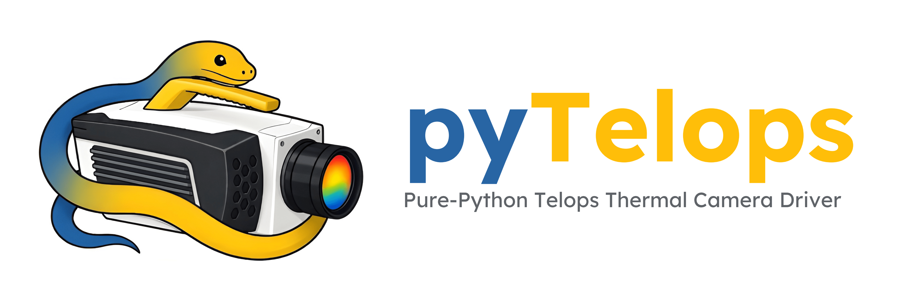

pyTelops
========

.. image:: https://github.com/ladisk/pyTelops/actions/workflows/testing.yml/badge.svg
   :target: https://github.com/ladisk/pyTelops/actions/workflows/testing.yml
   :alt: Tests

.. image:: https://readthedocs.org/projects/pytelops/badge/?version=latest
   :target: https://pytelops.readthedocs.io/en/latest/
   :alt: Documentation

.. image:: https://img.shields.io/pypi/v/pyTelops.svg
   :target: https://pypi.org/project/pyTelops/

.. image:: https://img.shields.io/pypi/l/pyTelops.svg
   :target: https://github.com/ladisk/pyTelops/blob/master/LICENSE

Pure-Python driver for `Telops <https://www.telops.com/>`_ thermal cameras
over GigE Vision. No vendor SDK required; communicates directly via GVCP/GVSP
protocols over UDP.

Supported cameras:

- Telops FAST M3k (tested)
- Other Telops GigE Vision cameras (should work, untested)

Features
--------

- **Auto-discovery**: finds cameras on the network regardless of IP
- **High-speed buffer**: record to the 16 GB onboard buffer at full sensor
  speed, then download over Ethernet
- **Live streaming**: real-time frame acquisition
- **Subwindow**: configurable resolution for higher frame rates
- **Diagnostics**: 13 temperature sensors, NUC trigger, timestamps, voltage/current
- **GUI viewer & CLI**: live thermal display, ``pytelops discover / grab / live``

Installation
------------

.. code-block:: bash

   pip install pyTelops

For the GUI viewer:

.. code-block:: bash

   pip install pyTelops[gui]

Quick start
-----------

.. code-block:: python

   from pyTelops import Camera

   with Camera() as cam:
       cam.calibration_mode = "RT"      # radiometric temperature
       cam.integration_time_auto = "continuous"  # auto integration time (or "off" for manual)
       # cam.integration_time = 50.0             # set manually when integration_time_auto is "off"

       frame = cam.grab()               # single frame -> numpy (H, W)
       frames = cam.acquire(10)         # 10 frames -> numpy (N, H, W)

Frames are returned as numpy arrays with Telops header rows already stripped.

Documentation
-------------

Full documentation at https://pytelops.readthedocs.io.

The sections below walk through the camera the way you use it: find it,
connect, configure, capture, and disconnect.

Discovery
---------

``discover()`` lists the GigE Vision cameras on the network, regardless of
their IP. It searches every host network interface, so a camera on a
USB-to-GigE adapter or a secondary NIC is found without naming an interface:

.. code-block:: python

   from pyTelops import discover

   for cam in discover():
       print(cam["model"], cam["ip"], cam["serial"])

Each result is a dict with ``manufacturer``, ``model``, ``ip``, and ``serial``.

Connect
-------

``Camera()`` auto-discovers and connects to the first camera found; pass an IP
to target a specific one. As a context manager it connects on entry and
disconnects on exit:

.. code-block:: python

   from pyTelops import Camera

   with Camera() as cam:          # or Camera(ip="169.254.1.10")
       print(cam.info)            # all current settings as a dict
       print(cam.state)           # "connected"

Configure
---------

All settings are properties with string enum support:

.. code-block:: python

   cam.integration_time = 50.0            # microseconds
   cam.frame_rate = 2000.0               # Hz (warns if above max)
   cam.frame_rate_max                    # max Hz for current resolution/integration time
   cam.frame_rate_mode = "fixed"         # "fixed", "fixed_locked", "maximum", "burst"
   cam.calibration_mode = "RT"           # "RT", "NUC", "RAW", "IBR", "IBI"
   cam.integration_time_auto = "continuous"  # "off", "once", "continuous"
   cam.resolution = (128, 128)            # subwindow for higher fps
   cam.roi_offset = (10, 20)             # subwindow offset (x, y)
   cam.valid_widths                      # [64, 128, 192, 256, 320]
   cam.valid_heights                     # [4, 8, 12, ..., 252, 256]
   cam.bad_pixel_replacement = True      # auto-replace hot pixels (ON by default)
   cam.reverse_x = True                  # horizontal flip
   cam.reverse_y = True                  # vertical flip
   cam.test_image = "static"             # "off", "static", "dynamic", "constant"
   cam.trigger_frame_count = 10          # frames per trigger event
   cam.temperature                       # sensor temperature in Celsius
   cam.info                              # dict with all settings
   cam.state                             # "disconnected", "connected", "streaming", "standby", "not_ready", "error"

Calibration
-----------

Each lens + temperature range has its own calibration data on the camera.
Load lens/temperature info from the USB drive shipped with the camera:

.. code-block:: python

   cam.load_calibration_info("path/to/TEL-8050 Calibration Data/")
   cam.calibration_collections()
   # [{'index': 0, 'lens': 'MW Microscope 1X', 'temp_range': (0, 204), ...},
   #  {'index': 4, 'lens': 'MW 25mm',          'temp_range': (0, 184), ...},
   #  {'index': 8, 'lens': 'MW 50mm',          'temp_range': (0, 175), ...}, ...]

   # Select by lens name + target temperature
   cam.calibration_load(lens="50mm", temp=25)       # MW 50mm, 0-175 C range
   cam.calibration_load(lens="25mm", temp=300)       # MW 25mm, 115-376 C range

   # Or by index
   cam.calibration_load(index=4)

   # Check what's loaded
   cam.calibration_active()

Resolution / subwindow
----------------------

Reduce resolution for higher frame rates. Width: step 64 (64-320).
Height: step 4 (4-256). Heights are in usable pixels; the driver adds 2 header
rows internally.

.. code-block:: python

   cam.resolution = (128, 64)             # 128x64 pixels
   cam.roi_offset = (96, 96)              # offset within full sensor
   cam.frame_rate_max                     # check achievable fps

   cam.valid_widths                       # [64, 128, 192, 256, 320]
   cam.valid_heights                      # [4, 8, 12, ..., 252, 256]

Example frame rates measured at different resolutions on one camera and setup
(your maximums depend on the specific unit, integration time, and firmware):

==========  ==========  =========
Resolution  Int. time   Max FPS
==========  ==========  =========
320x256     10 us       3,115
320x128     10 us       5,973
320x64      10 us       11,034
128x64      10 us       17,836
64x32       10 us       36,676
64x4        10 us       64,491
64x4        5 us        95,184
==========  ==========  =========

Grab a frame
------------

.. code-block:: python

   frame = cam.grab()             # single frame -> numpy (H, W)
   raw = cam.grab(convert=False)  # raw uint16 instead of Celsius

In RT mode, ``grab()``, ``acquire()``, and ``buffer_download()`` automatically
convert to Celsius (float32). Use ``convert=False`` for raw uint16 values.
Header rows are stripped by default (``strip_header=True``).

Live streaming
--------------

Frames stream directly to the PC over Ethernet, limited by GigE bandwidth
(~125 MB/s). On one test setup this reached about 760 fps at full frame
(320×256); achievable rates depend on the host, NIC, and network path.

.. code-block:: python

   frame = cam.grab()             # single frame
   frames = cam.acquire(100)      # 100 frames -> numpy (N, H, W)

Use streaming for continuous capture at moderate frame rates. For high-speed
measurements (thousands of fps), record to the onboard buffer instead (below).

Live viewer
-----------

.. code-block:: python

   with Camera() as cam:
       cam.live_view()

Or from the command line:

.. code-block:: bash

   pytelops live

Opens a Tkinter window with real-time thermal display, percentile
normalization (handles hot pixels), and colormap selector.

Buffer recording
----------------

The camera records to its internal 16 GB memory at full sensor speed, then
downloads to the PC. The buffer must be partitioned into fixed-size sequence
slots before recording:

.. code-block:: python

   from pyTelops import Camera

   with Camera() as cam:
       cam.frame_rate = 2000.0
       cam.integration_time = 30.0

       # Allocate: 3 sequences of 5 seconds each (uses current frame_rate)
       cam.buffer_configure(n_sequences=3, duration=5.0,
                            moi_source="software")

       # Record all sequences in one call
       cam.buffer_record()   # arms, fires MOI for each, waits, stops

       # Review
       print(cam.buffer_info())
       # {'status': 'IDLE', 'n_sequences': 3, 'recorded': [10000, 10000, 10000], ...}

       # Download selected sequences
       data_0 = cam.buffer_download(sequence=0)
       data_2 = cam.buffer_download(sequence=2)

       # Clean up
       cam.buffer_clear()

``buffer_record()`` prints progress::

   Arming (seq 1/3)... Recording... Done (10000 frames)
   Firing (seq 2/3)... Recording... Done (10000 frames)
   Firing (seq 3/3)... Recording... Done (10000 frames)

``buffer_download()`` shows a tqdm progress bar and data integrity check::

   Downloading: 100%|██████████| 10000/10000 [00:36<00:00, 271.84frame/s]
   Downloaded 10000 frames in 36.8s (271 fps, 44.8 MB/s)
   Data check: OK - 10000 frames, range [24.9-36.2], mean 28.1

If a download finishes with missing frames, ``buffer_download()`` raises
``FrameIntegrityError`` by default. See the `documentation
<https://pytelops.readthedocs.io/en/latest/streaming_and_buffer.html>`_ for
tolerating drops and inspecting ``cam.last_download_stats``.

External trigger
----------------

For triggered recording from an external BNC signal:

.. code-block:: python

   with Camera() as cam:
       cam.configure_trigger(source="external", activation="rising")

       cam.buffer_configure(n_sequences=1, frames_per_seq=5000,
                            pre_moi=1000,
                            moi_source="external")

       cam.buffer_arm()                  # arm and wait for trigger
       cam.buffer_wait(timeout=60.0)     # blocks until recording completes
       data = cam.buffer_download()

For manual control with software MOI (instead of ``buffer_record()``):

.. code-block:: python

   cam.buffer_arm()                      # arm the buffer
   cam.buffer_fire_moi()                 # software MOI trigger
   cam.buffer_wait(timeout=30.0)         # wait for recording to finish
   data = cam.buffer_download()

Disconnect
----------

The context manager disconnects automatically on exit. To manage the
connection manually, call ``connect()`` and ``disconnect()`` yourself:

.. code-block:: python

   cam = Camera()
   cam.connect()
   # ... use the camera ...
   cam.disconnect()

Image correction (NUC)
----------------------

Trigger a Non-Uniformity Correction programmatically:

.. code-block:: python

   cam.nuc()                              # one-point NUC (blocks until done)
   cam.nuc(mode="icu")                    # using internal calibration unit
   cam.nuc(blackbody_temp=25.0)           # with blackbody reference temperature

Diagnostics
-----------

Read temperature sensors, voltages, currents, and uptime counters:

.. code-block:: python

   cam.sensor_temperature("sensor")       # single sensor, Celsius
   cam.sensor_temperature("compressor")
   cam.sensor_temperature("processing_fpga")

   cam.diagnostics()                      # all sensors at once (dict)
   # {'temperatures': {'sensor': 25.1, 'compressor': 18.3, ...},
   #  'voltages': {'cooler': 12.1, ...},
   #  'currents': {'cooler': 0.8, ...},
   #  'device_running_s': 123456, 'power_on_cycles': 42, ...}

Time synchronization
--------------------

.. code-block:: python

   cam.sync_time()                        # set camera clock to host UTC
   cam.posix_time                         # read as Python datetime
   cam.gev_timestamp_ns                   # GigE Vision timestamp (nanoseconds)

Device management
-----------------

.. code-block:: python

   cam.save_config()                      # persist settings to camera memory

CLI
---

.. code-block:: bash

   pytelops discover     # find cameras on the network
   pytelops info         # show camera configuration
   pytelops grab -o frame.npy   # grab a single frame
   pytelops live         # open live viewer
   pytelops setup        # configure OS (firewall, MTU)

Network setup
-------------

The driver auto-recovers from stale sessions (e.g., after a crash or kernel restart)
and auto-waits if the camera is cooling down.

GigE Vision requires a firewall rule to allow inbound UDP from the camera:

**Windows** (run once as admin):

.. code-block:: bash

   netsh advfirewall firewall add rule name="pyTelops-GVSP" dir=in action=allow protocol=UDP program="C:\path\to\python.exe"

**Linux**:

.. code-block:: bash

   sudo sysctl -w net.core.rmem_max=16777216

Or use the built-in setup helper:

.. code-block:: bash

   pytelops setup

Troubleshooting
---------------

For firewall setup, ``packets unrecoverable`` warnings at high frame rates,
growing lag in live displays, buffer-download failures, discovery problems
caused by a VPN's virtual link-local adapter, and more, see the
`troubleshooting guide
<https://pytelops.readthedocs.io/en/latest/troubleshooting.html>`_.

Integration
-----------

pyTelops is designed to be used standalone or as a backend for data acquisition
frameworks:

- `openEOL <https://github.com/ladisk/openEOL>`_: industrial end-of-line testing
- `LDAQ <https://github.com/ladisk/LDAQ>`_: lightweight data acquisition

Disclaimer
----------

pyTelops is an independent, community-developed project. It is not affiliated
with, endorsed by, or supported by Telops Inc. Register addresses were obtained
from the camera's standard GenICam XML descriptor and documentation shipped with
the camera hardware. No Telops proprietary source code was used.

"Telops", "FAST", and "Reveal IR" are trademarks of `Telops Inc. <https://www.telops.com>`_
All other trademarks are the property of their respective owners.

License
-------

MIT
